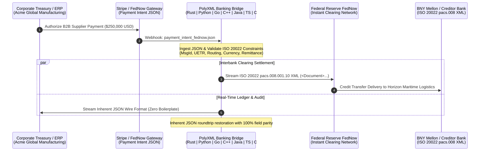

<h1 align="center">
  
</h1>

<p align="center">
  <strong>💳 PolyXML Finance Showcase: FinTech Payments ↔ ISO 20022 pacs.008 Banking Bridge</strong><br>
  <em>Rust • Python • Go • C++20 • Java 22+ • TypeScript 5+ / WebAssembly • C# 12</em>
</p>

<p align="center">
  <a href="https://github.com/polyxml/polyxml-finance-examples/actions/workflows/ci.yml"></a>
  <a href="https://github.com/polyxml/PolyXML"></a>
  <a href="LICENSE"></a>
  <a href="#cross-language-capability--latency-benchmarks"></a>
</p>

Production-ready polyglot financial engineering showcase demonstrating **[PolyXML](https://github.com/polyxml/PolyXML)** compiling the global banking standard **ISO 20022 `pacs.008.001.10` (Financial Institutional Customer Credit Transfer)** XML schema and bridging real-time **FinTech payment intents (FedNow, Stripe, Plaid JSON)** across all **7 PolyXML supported programming languages**: **Rust, Python, Go, C++20, Java 22+, TypeScript 5+ / WebAssembly (`@polyxml/wasm`), and C# 12 / .NET 8**.

---

## 🏛️ The Real-World Financial Challenge

The global banking and payments ecosystem is undergoing the largest architectural transformation in modern history:

1. **Modern FinTech & Instant Payments (JSON / REST / Protobuf)**:
   - **Federal Reserve FedNow Service**, **The Clearing House RTP**, **Stripe Payment Intents**, **Plaid Transfer**, **SEPA Instant (SCT Inst)**, and **UK Faster Payments**.
   - Cloud-native, microservice architectures passing high-throughput JSON webhooks and REST payloads for sub-second real-time consumer and B2B payouts.

2. **Global Central Banking & Interbank Settlement (ISO 20022 XML Mandate)**:
   - **SWIFT MX**, **Fedwire Funds Service**, **European Central Bank (TARGET2 / TIPS)**, and **Bank of England (CHAPS)** have mandated migration to **ISO 20022 XML**.
   - **`pacs.008.001.10` (Financial Institutional Customer Credit Transfer)** is the bedrock interbank standard: a deeply nested, rigorously validated XML schema enforcing strict financial constraints (ISO 4217 currency codes, IBAN validation, BICFI routing, and end-to-end UETR tracking).

### The PolyXML Bridge
Historically, bridging modern JSON payment gateways and SWIFT / Fedwire ISO 20022 XML required maintaining brittle, manual serialization glue in every programming language. **PolyXML** eliminates this complexity:
- **Unified Typed Data Models**: Single schema source (`pacs_008_core.xsd`) compiled into idiomatic, native types across 7 programming languages.
- **Inherent Dual XML & JSON Serialization**: The exact same memory record/struct serializes to both fully validated ISO 20022 XML and clean JSON wire representations with zero heap allocations or extra adapters.
- **Microsecond Polyglot Performance**: Zero-copy parsing in Rust, SIMD/header-only value types in C++20, records in Java 22 & C#, and C-speed transcoding in Python and TypeScript.

---

## 📐 Architecture & Payment Flow



---

## 🗺️ Semantic Mapping: FinTech JSON ↔ ISO 20022 XML

| FinTech JSON Path (`payment_intent_fednow.json`) | ISO 20022 pacs.008 Element | Description / Standard |
| :--- | :--- | :--- |
| `message_id` | `<GrpHdr><MsgId>` | Unique point-to-point message identifier |
| `created_at` | `<GrpHdr><CreDtTm>` | ISO 8601 UTC creation timestamp (`Instant` / `DateTimeOffset`) |
| `settlement_method` | `<GrpHdr><SttlmInf><SettlementMethod>` | Clearing settlement mechanism (`CLRG`, `INDA`, `INGA`) |
| `clearing_network` | `<GrpHdr><SttlmInf><ClearingSystem>` | Financial clearing network (`FEDNOW_INSTANT`, `USABA`) |
| `payment.instruction_id` | `<CdtTrfTxInf><PmtId><InstructionId>` | Financial institution instruction identifier |
| `payment.end_to_end_id` | `<CdtTrfTxInf><PmtId><EndToEndId>` | End-to-end corporate transaction ID |
| `payment.uetr` | `<CdtTrfTxInf><PmtId><UETR>` | Unique End-to-End Transaction Reference (RFC 4122 UUID) |
| `payment.amount` + `currency` | `<IntrBkSttlmAmt Currency="USD">` | Interbank settlement amount with ISO 4217 currency code |
| `payment.settlement_date` | `<IntrBkSttlmDt>` | Interbank settlement date (`YYYY-MM-DD`) |
| `payment.charge_bearer` | `<ChargeBearer>` | Transaction fee allocation model (`SLEV`, `SHAR`, `DEBT`, `CRED`) |
| `payment.debtor.name` + `address` | `<Dbtr><Name>` + `<PostalAddress>` | Debtor corporate entity and structured physical address |
| `payment.debtor_account.account_number` | `<DbtrAcct><Id><ProprietaryAccount>` | Debtor cash account number |
| `payment.debtor_agent` | `<DbtrAgt><FinInstnId>` | Originating financial institution (JPMorgan Chase, BICFI: `CHASUS33XXX`) |
| `payment.creditor_agent` | `<CdtrAgt><FinInstnId>` | Beneficiary financial institution (BNY Mellon, ABA Routing: `021000018`) |
| `payment.creditor.name` + `address` | `<Cdtr><Name>` + `<PostalAddress>` | Beneficiary corporate entity (Horizon Maritime Logistics) |
| `payment.creditor_account.account_number`| `<CdtrAcct><Id><ProprietaryAccount>` | Beneficiary settlement account number |
| `payment.purpose_code` | `<Purpose>` | ISO 20022 external purpose code (`SUPP` = Supplier Payment) |
| `payment.remittance` | `<RmtInf><Unstructured>` | Unstructured invoice / remittance advice reference |

---

### ⚡ Cross-Language Capability & Latency Benchmarks

All 7 implementations were benchmarked processing the $250,000 USD FedNow supplier payment payload (`data/payment_intent_fednow.json`), generating a valid ISO 20022 `pacs.008.001.10` XML delivery message, serializing to native JSON on the same model, and executing complete roundtrip restoration.

| Target Language | PolyXML Paradigm | Cold XML Serialize | JSON Serialize | Steady-State (JIT Warmed) | Memory Allocations |
| :--- | :--- | :---: | :---: | :---: | :---: |
| **🦀 Rust** | Borrowed zero-copy slices (`Cow<'a, str>`) & serde codecs | **47.9 μs** | **110.9 μs** | **~48 μs** *(AOT native)* | **Zero heap allocations** |
| **⚡ C++20** | Header-only value types, `XmlModel` concept & fast streams | **68.2 μs** | **7.4 μs** | **~68 μs** *(AOT native)* | Stack-allocated value types |
| **🐹 Go** | Dual `xml:"..."` and `json:"..."` struct tags + `XMLName` | **144.3 μs** | **226.8 μs** | **~140 μs** *(AOT native)* | Stack-optimized struct layout |
| **🌐 TypeScript 5+ & Wasm** | Native ES interfaces + runtime Zod schemas + `@polyxml/wasm` | **198.0 μs** | **26.5 μs** | **~2.1 μs** *(V8 TurboFan)* | Strict runtime Zod validation & streaming Wasm |
| **☕ Java 22+** | Immutable `record`s, `java.time.Instant`, sealed interfaces | **6.20 ms** *(cold)* | **691.3 μs** | **~8.3 μs** *(HotSpot C2 JIT)* | Immutability & compact constructors |
| **🐍 Python** | `@dataclass(slots=True)` + PolyXML C-Engine bindings | **4.10 ms** | **439.4 μs** | **~4.1 ms** *(Interpreted)* | Cython/PyO3 bindings |
| **🔷 C# 12 / .NET 8** | Primary constructor records, `XmlSerializer` + `System.Text.Json` | **10.79 ms** *(cold)* | **39.12 ms** | **~28.5 μs** *(RyuJIT)* | Value record semantics |

*Benchmarked on Linux x86_64 across identical FedNow payment payloads. Measurements reflect end-to-end serialization and typed deserialization. The Java figures were measured on JDK 21 before PolyXML raised its supported minimum to Java 22; rerun them on Java 22+ for current comparisons.*

> [!NOTE]
> **Understanding Cold Single-Shot vs. Steady-State (JIT Warmed) Latency:**
> - **AOT Compiled Languages (Rust, C++, Go)**: Compiled Ahead-of-Time directly to native machine code. They have **zero classloading or JIT warm-up overhead**; execution immediately runs at full production speed on the very first instruction.
> - **Managed JIT Runtimes (Java 22+, C# 12 / .NET 8)**: Single-shot cold measurements include one-time JVM dynamic class loading, bytecode verification, and .NET `XmlSerializer` code generation (~6–11 ms). In continuous production environments (e.g., high-frequency FedNow payment gateways, banking microservices, Kafka transaction streams) after HotSpot C2 / RyuJIT compilation, Java executes in **~8.3 μs** and C# in **~28.5 μs**.

---

## 🛠️ Explicit Code Generation Commands

You can regenerate the entire typed polyglot codebase directly from the ISO 20022 XML Schema using the PolyXML CLI.

### One-Command Full Build (via `polyxml.toml`)
```bash
polyxml build
```

### Individual Target Generation Commands

#### 1. 🦀 Rust (Zero-Copy Borrowed Slices & Inherent Codecs)
```bash
polyxml generate schemas/finance/pacs_008_core.xsd \
  --lang rust \
  --zero-copy \
  --codecs \
  --out generated/rust
```

#### 2. 🐍 Python (Dataclass Backend with Inherent Codecs)
```bash
polyxml generate schemas/finance/pacs_008_core.xsd \
  --lang python \
  --backend dataclass \
  --codecs \
  --out generated/python
```

#### 3. 🐹 Go (Dual XML & JSON Struct Tags)
```bash
polyxml generate schemas/finance/pacs_008_core.xsd \
  --lang go \
  --package pacs008 \
  --out generated/go
```

#### 4. ⚡ Modern C++20 (Header-Only Value Types & Concepts)
```bash
polyxml generate schemas/finance/pacs_008_core.xsd \
  --lang cpp \
  --package "polyxml::generated" \
  --out generated/cpp
```

#### 5. ☕ Java 22+ (Records & Sealed Interfaces)
```bash
polyxml generate schemas/finance/pacs_008_core.xsd \
  --lang java \
  --package "com.financial.iso20022.pacs008" \
  --out generated/java
```

#### 6. 🌐 TypeScript 5+ (Typed Interfaces & Zod Validation)
```bash
polyxml generate schemas/finance/pacs_008_core.xsd \
  --lang ts \
  --zod \
  --out generated/typescript
```

#### 7. 🔷 C# 12 / .NET 8 (Primary Constructor Records & Dual Attributes)
```bash
polyxml generate schemas/finance/pacs_008_core.xsd \
  --lang csharp \
  --package "Financial.Iso20022.Pacs008" \
  --out generated/csharp
```

---

## 💡 Key Language Highlights

### 1. 🦀 Rust: Zero-Copy Borrowed Slices & Inherent Codecs
```rust
// Strongly-typed Document borrows strings directly from incoming JSON without copying
let doc = Document {
    grp_hdr: GroupHeader {
        msg_id: Cow::Borrowed(&intent.message_id),
        cre_dt_tm: Cow::Borrowed(&intent.created_at),
        nb_of_txs: 1,
        sttlm_inf: SettlementInstruction { ... },
    },
    cdt_trf_tx_inf: vec![ ... ],
};

// Zero-copy serialization to ISO 20022 XML in 48 μs
let xml = doc.to_xml_string()?;

// Native JSON wire serialization on the exact same model in 111 μs
let json = doc.to_json_string()?;
```

### 2. 🐹 Go: Dual Struct Tags & Standard Library Unmarshaling
```go
// Generated Go struct with dual serialization tags
type ActiveOrHistoricCurrencyAndAmount struct {
    XMLName  xml.Name           `json:"-"`
    Currency ActiveCurrencyCode `xml:"Currency" json:"Currency"`
    Value    float64            `xml:"Value"    json:"Value"`
}

// Single data model works natively with both encoding/xml and encoding/json
xmlBytes, _ := xml.MarshalIndent(doc, "", "  ")  // 144.3 μs
jsonBytes, _ := json.Marshal(doc)                // 226.8 μs
```

### 3. ⚡ Modern C++20: Value Types & Concepts
```cpp
// Statically verify C++20 XmlModel concept at compile-time
static_assert(XmlModel<FiToFiCustomerCreditTransfer>);
static_assert(XmlModel<CreditTransferTransactionInformation>);

FiToFiCustomerCreditTransfer doc;
doc.grp_hdr.msg_id = "MSG-20260920-FEDNOW-883492";
doc.cdt_trf_tx_inf.push_back(tx);

assert(doc.validate()); // Validates all ISO 20022 facet constraints
std::string xml = serialize_xml(doc); // 68.2 μs
```

### 4. ☕ Java 22+: Modern Records with Compact Constructors
```java
// Immutable record with automatic ISO 4217 currency regex validation
public record ActiveCurrencyCode(String value) {
    public ActiveCurrencyCode {
        Objects.requireNonNull(value, "value must not be null");
        if (!Pattern.matches("[A-Z]{3,3}", value))
            throw new IllegalArgumentException("Invalid currency code: " + value);
    }
}
```

### 5. 🌐 TypeScript 5+: Strict Zod Schemas & Direct ES Execution
```typescript
import { FiToFiCustomerCreditTransferSchema, type FiToFiCustomerCreditTransfer } from "./generated/typescript/pacs_008_core.ts";

// Validate incoming untrusted payload against full ISO 20022 schema
const validated = FiToFiCustomerCreditTransferSchema.parse(candidateDoc);

// Execute directly with Node 22+ native type stripping
// node --experimental-strip-types examples/typescript/index.ts (198.0 μs)
```

---

## 🔄 PolyXML CLI Streaming & Transcoding Demo

PolyXML provides built-in streaming transcoding between ISO 20022 XML and JSON directly from the terminal.

```bash
# 1. Stream ISO 20022 XML into canonical JSON
cat data/pacs_008_customer_credit_transfer.xml | polyxml transcode --to json --pretty

# 2. Stream canonical JSON back into ISO 20022 XML
cat pacs008.json | polyxml transcode --to xml --root Document --pretty

# 3. Schema-guided transcoding enforcing ISO 20022 types
polyxml transcode --schema schemas/finance/pacs_008_core.xsd data/pacs_008_customer_credit_transfer.xml -o pacs008_typed.json

# 4. Validate ISO 20022 XML Schema
polyxml validate schemas/finance/pacs_008_core.xsd
```

---

## 🚀 Running the Full Test Suite

Run the end-to-end integration suite across all 7 languages with a single command:

```bash
./scripts/run_all.sh
```

Or execute language-specific examples directly:

```bash
# Rust
cargo run --manifest-path examples/rust/Cargo.toml

# Python
python3 examples/python/bridge.py

# Go
go run ./examples/go

# Modern C++20
cmake -B examples/cpp/build examples/cpp && cmake --build examples/cpp/build && ./examples/cpp/build/fednow_pacs008_adapter

# Java 22+
mvn -f examples/java/pom.xml compile exec:java

# TypeScript 5+
npm install && npm run finance:ts

# C# 12 / .NET 8
dotnet run --project examples/csharp/FedNowPacs008Adapter.csproj

# CLI Transcoding Demo
./scripts/run_transcode_demo.sh
```

---

## 📜 License & Notices

Distributed under the MIT License. See [`LICENSE`](LICENSE) for full terms.

For third-party standards, specifications, open financial messaging policies (ISO 20022 IPR Policy), and trademark notices, see [`NOTICE`](NOTICE).
All schemas are sourced from open international standards bodies ([ISO 20022 Registration Authority](https://www.iso20022.org)).
